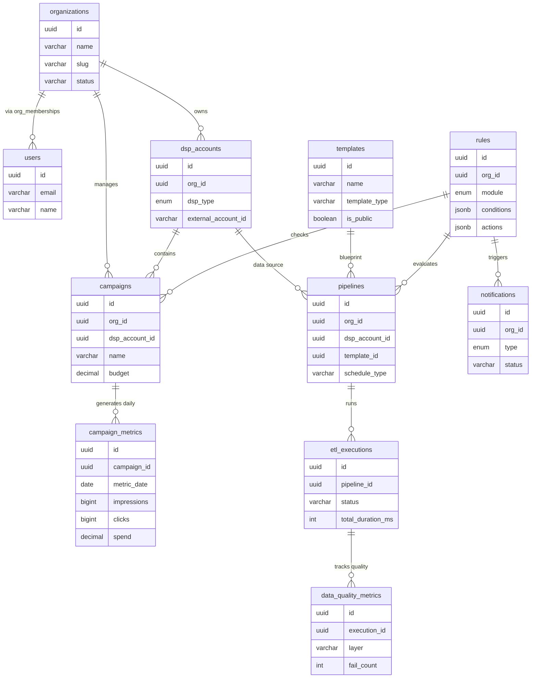
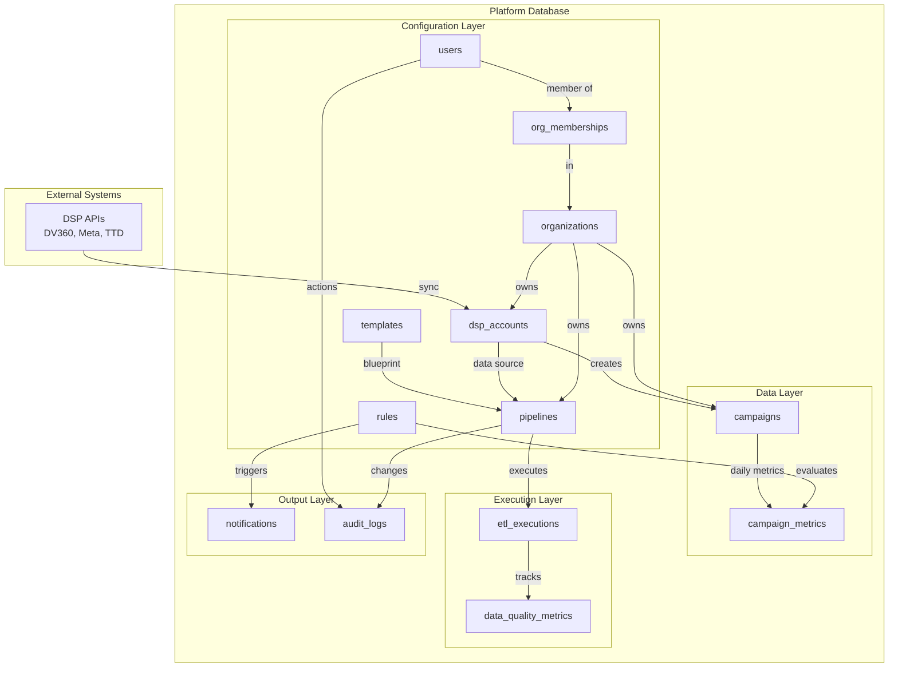

# Entity Relationship Diagram
## Campaign Lifecycle Platform Schema v1.0.0

---

## Complete ER Diagram (All Tables)

```mermaid
erDiagram
    organizations ||--o{ org_memberships : "has"
    organizations ||--o{ dsp_accounts : "owns"
    organizations ||--o{ templates : "creates"
    organizations ||--o{ pipelines : "configures"
    organizations ||--o{ rules : "defines"
    organizations ||--o{ campaigns : "manages"
    organizations ||--o{ campaign_metrics : "tracks"
    organizations ||--o{ etl_executions : "runs"
    organizations ||--o{ data_quality_metrics : "monitors"
    organizations ||--o{ notifications : "receives"
    organizations ||--o{ entity_permissions : "grants"
    organizations ||--o{ audit_logs : "logs"
    
    users ||--o{ org_memberships : "belongs_to"
    users ||--o{ auth_tokens : "has"
    users ||--o{ entity_permissions : "granted_to"
    users ||--o{ audit_logs : "performs"
    users ||--o{ templates : "creates"
    users ||--o{ pipelines : "creates"
    users ||--o{ rules : "creates"
    users ||--o{ notifications : "receives"
    
    dsp_accounts ||--o{ campaigns : "contains"
    dsp_accounts ||--o{ pipelines : "sources"
    
    templates ||--o{ pipelines : "instantiates"
    
    pipelines ||--o{ etl_executions : "executes"
    pipelines ||--o{ rules : "applies_to"
    
    campaigns ||--o{ campaign_metrics : "generates"
    
    etl_executions ||--o{ data_quality_metrics : "measures"
    
    organizations {
        uuid id PK
        varchar name
        varchar slug UK
        varchar domain
        varchar status
        varchar plan
        decimal monthly_budget
        varchar industry
        varchar company_size
        jsonb settings
        timestamp created_at
        timestamp updated_at
        timestamp deleted_at
    }
    
    users {
        uuid id PK
        varchar email UK
        varchar password_hash
        varchar name
        varchar auth_provider
        varchar auth_provider_id
        boolean is_active
        boolean email_verified
        boolean mfa_enabled
        varchar mfa_secret
        timestamp last_login_at
        timestamp last_activity_at
        int login_count
        text avatar_url
        varchar timezone
        varchar locale
        jsonb metadata
        timestamp created_at
        timestamp updated_at
        timestamp deleted_at
    }
    
    org_memberships {
        uuid id PK
        uuid org_id FK
        uuid user_id FK
        enum role
        jsonb permissions
        boolean is_active
        uuid invited_by FK
        timestamp joined_at
        timestamp created_at
        timestamp updated_at
    }
    
    auth_tokens {
        uuid id PK
        uuid user_id FK
        uuid org_id FK
        varchar token_type
        varchar token_hash UK
        varchar token_prefix
        jsonb scopes
        varchar name
        text user_agent
        inet ip_address
        timestamp expires_at
        timestamp last_used_at
        boolean is_active
        timestamp revoked_at
        uuid revoked_by FK
        timestamp created_at
    }
    
    dsp_accounts {
        uuid id PK
        uuid org_id FK
        enum dsp_type
        varchar external_account_id
        varchar display_name
        varchar oauth_token_path
        bytea credentials_encrypted
        timestamp token_expires_at
        jsonb rate_limit_config
        boolean is_active
        timestamp last_sync_at
        varchar last_sync_status
        text sync_error
        varchar parent_account_id
        varchar account_timezone
        varchar currency
        jsonb metadata
        timestamp created_at
        timestamp updated_at
    }
    
    templates {
        uuid id PK
        varchar name
        text description
        varchar category
        varchar template_type
        enum dsp_type
        jsonb config
        jsonb default_params
        jsonb required_inputs
        jsonb optional_inputs
        boolean is_public
        uuid created_by FK
        uuid org_id FK
        int usage_count
        decimal satisfaction_rating
        int version
        uuid parent_template_id FK
        boolean is_active
        timestamp created_at
        timestamp updated_at
    }
    
    pipelines {
        uuid id PK
        uuid org_id FK
        varchar name
        text description
        uuid dsp_account_id FK
        uuid template_id FK
        varchar connector_type
        varchar schedule_type
        varchar schedule_cron
        int schedule_interval_minutes
        varchar schedule_timezone
        jsonb config
        jsonb retry_config
        varchar status
        boolean is_active
        uuid last_execution_id
        timestamp last_run_at
        varchar last_run_status
        timestamp next_run_at
        int total_executions
        int successful_executions
        int failed_executions
        uuid created_by FK
        timestamp created_at
        timestamp updated_at
    }
    
    rules {
        uuid id PK
        uuid org_id FK
        varchar name
        text description
        enum module
        varchar rule_type
        jsonb conditions
        jsonb actions
        int priority
        boolean is_enabled
        uuid pipeline_id FK
        enum entity_type
        jsonb entity_filters
        int execution_count
        int match_count
        timestamp last_executed_at
        timestamp last_match_at
        int version
        uuid parent_rule_id FK
        uuid created_by FK
        timestamp created_at
        timestamp updated_at
    }
    
    campaigns {
        uuid id PK
        uuid org_id FK
        uuid dsp_account_id FK
        enum dsp_type
        varchar external_id
        varchar name
        varchar advertiser_id
        varchar advertiser_name
        varchar parent_id
        varchar parent_name
        varchar status
        boolean is_active
        decimal budget
        varchar currency
        varchar budget_type
        date start_date
        date end_date
        jsonb config
        jsonb targeting
        jsonb labels
        jsonb metadata
        timestamp last_synced_at
        int sync_version
        timestamp created_at
        timestamp updated_at
    }
    
    campaign_metrics {
        uuid id PK
        uuid campaign_id FK
        uuid org_id FK
        date metric_date
        bigint impressions
        bigint clicks
        bigint conversions
        bigint views
        decimal spend
        decimal revenue
        decimal ctr
        decimal cpc
        decimal cpm
        decimal cpa
        decimal cvr
        decimal roas
        jsonb custom_metrics
        decimal data_quality_score
        boolean has_data_issues
        timestamp synced_at
        timestamp created_at
        timestamp updated_at
    }
    
    etl_executions {
        uuid id PK
        uuid pipeline_id FK
        uuid org_id FK
        varchar execution_type
        varchar status
        varchar bronze_status
        bigint bronze_records
        bigint bronze_size_bytes
        int bronze_duration_ms
        varchar silver_status
        bigint silver_records
        bigint silver_records_filtered
        int silver_duration_ms
        varchar gold_status
        jsonb gold_tables_updated
        int gold_duration_ms
        bigint total_records_processed
        bigint total_records_failed
        int total_duration_ms
        jsonb config
        text error_message
        jsonb error_details
        int retry_count
        varchar workflow_id
        varchar run_id
        timestamp scheduled_at
        timestamp started_at
        timestamp completed_at
        timestamp created_at
    }
    
    data_quality_metrics {
        uuid id PK
        uuid execution_id FK
        uuid pipeline_id FK
        uuid org_id FK
        varchar layer
        varchar metric_type
        varchar metric_name
        int check_count
        int pass_count
        int fail_count
        varchar severity
        jsonb details
        jsonb sample_failures
        timestamp measured_at
    }
    
    notifications {
        uuid id PK
        uuid org_id FK
        uuid user_id FK
        enum type
        varchar channel
        varchar recipient
        varchar subject
        text body
        varchar template_id
        jsonb template_data
        varchar status
        int priority
        timestamp scheduled_at
        timestamp sent_at
        text error_message
        int retry_count
        int max_retries
        jsonb metadata
        enum entity_type
        uuid entity_id
        timestamp created_at
    }
    
    entity_permissions {
        uuid id PK
        uuid org_id FK
        uuid user_id FK
        enum role
        enum entity_type
        uuid entity_id
        jsonb permissions
        uuid granted_by FK
        timestamp granted_at
        timestamp expires_at
        timestamp created_at
    }
    
    audit_logs {
        uuid id PK
        uuid org_id FK
        uuid user_id FK
        varchar action
        varchar resource_type
        uuid resource_id
        jsonb old_values
        jsonb new_values
        jsonb changes
        inet ip_address
        text user_agent
        varchar request_id
        varchar session_id
        boolean success
        text error_message
        timestamp created_at
    }
    
    permissions {
        uuid id PK
        varchar resource
        varchar action
        text description
    }
    
    role_permissions {
        enum role PK
        uuid permission_id PK_FK
    }
```

---

## Core Entity Relationships



---

## Data Flow Architecture



---

## Cardinality Reference

| Relationship | Type | Description |
|--------------|------|-------------|
| organizations → org_memberships | 1:N | One org has many members |
| users → org_memberships | 1:N | One user can belong to many orgs |
| organizations → dsp_accounts | 1:N | One org has many DSP accounts |
| dsp_accounts → campaigns | 1:N | One DSP account has many campaigns |
| campaigns → campaign_metrics | 1:N | One campaign has metrics for many days |
| templates → pipelines | 1:N | One template instantiated many times |
| pipelines → etl_executions | 1:N | One pipeline has many executions |
| etl_executions → data_quality_metrics | 1:N | One execution has many DQ checks |
| rules → pipelines | N:1 | Many rules can apply to one pipeline |
| users → auth_tokens | 1:N | One user has many tokens/sessions |
| organizations → notifications | 1:N | One org receives many notifications |

---

## Key Constraints

### Primary Keys
All tables use `UUID` as primary key (`id` column)

### Unique Constraints
- `organizations.slug` - URL-safe org identifier
- `users.email` - Email must be unique globally
- `org_memberships(org_id, user_id)` - User can't have duplicate membership
- `auth_tokens.token_hash` - Token hash must be unique
- `dsp_accounts(org_id, dsp_type, external_account_id)` - DSP account unique per org
- `pipelines(org_id, name)` - Pipeline name unique per org
- `campaigns(org_id, dsp_type, external_id)` - Campaign unique per org
- `campaign_metrics(campaign_id, metric_date)` - One metric record per day
- `rules(org_id, module, name, version)` - Rule name unique per module

### Foreign Key Cascades

**CASCADE on DELETE:**
- Organization deleted → All org data deleted
- Pipeline deleted → All executions deleted
- Campaign deleted → All metrics deleted
- User deleted → Memberships deleted

**SET NULL on DELETE:**
- User deleted → notifications.user_id = NULL (preserve notification)
- DSP account deleted → campaigns.dsp_account_id = NULL (preserve campaign)

---

## Index Strategy

### Multi-Tenant Queries
Every table with `org_id` has index:
```sql
CREATE INDEX idx_<table>_org ON <table>(org_id);
```

### Foreign Keys
All foreign key columns are indexed:
```sql
CREATE INDEX idx_<table>_<fk> ON <table>(<fk_column>);
```

### Composite Indexes
```sql
-- Org + Status filtering
CREATE INDEX idx_campaigns_org_status ON campaigns(org_id, status);

-- Org + Date range queries
CREATE INDEX idx_campaign_metrics_org_date ON campaign_metrics(org_id, metric_date DESC);

-- Pipeline scheduling
CREATE INDEX idx_pipelines_next_run ON pipelines(next_run_at) 
    WHERE is_active = true AND next_run_at IS NOT NULL;
```

### Partial Indexes
```sql
-- Only index active records
CREATE INDEX idx_pipelines_active ON pipelines(org_id, is_active) 
    WHERE is_active = true;

-- Only index pending notifications
CREATE INDEX idx_notifications_pending ON notifications(status, priority, created_at) 
    WHERE status = 'pending';
```

---

## Table Categories

### 1. Core Multi-Tenant (3 tables)
- `organizations` - Tenant root
- `users` - User accounts
- `org_memberships` - User-org relationships

### 2. Authentication & Authorization (4 tables)
- `auth_tokens` - Sessions, API keys
- `permissions` - System permissions
- `role_permissions` - Role mappings
- `entity_permissions` - Fine-grained access

### 3. DSP Integration (2 tables)
- `dsp_accounts` - DSP API credentials
- `campaigns` - Campaign data from DSPs

### 4. Performance Tracking (1 table)
- `campaign_metrics` - Daily performance metrics

### 5. Configuration & Templates (3 tables)
- `templates` - Reusable templates
- `pipelines` - ETL workflows
- `rules` - Business rules

### 6. Execution & Quality (2 tables)
- `etl_executions` - Job execution tracking
- `data_quality_metrics` - DQ monitoring

### 7. Operations (2 tables)
- `notifications` - Notification queue
- `audit_logs` - Complete audit trail

---

## ENUMs Reference

```sql
-- User roles (RBAC)
user_role: 'admin' | 'developer' | 'viewer' | 'analyst'

-- Organization status
org_status: 'active' | 'suspended' | 'trial' | 'deleted'

-- DSP types
dsp_type: 'dv360' | 'ttd' | 'meta' | 'amazon' | 'google_ads'

-- Entity types
entity_type: 'campaign' | 'insertion_order' | 'line_item' | 'creative' | 
             'template' | 'pipeline' | 'rule' | 'dsp_account'

-- Pipeline status
pipeline_status: 'active' | 'paused' | 'failed' | 'draft'

-- Execution status
execution_status: 'pending' | 'running' | 'completed' | 'failed' | 'cancelled'

-- Notification types
notification_type: 'email' | 'slack' | 'webhook' | 'sms' | 'push' | 'in_app'

-- Rule modules
rule_module: 'alerts' | 'qa' | 'taxonomy' | 'pacing' | 'margin'
```

---

## Views

### user_org_roles
Simplified view of users with their organizations and roles:
```sql
CREATE VIEW user_org_roles AS
SELECT 
    u.id as user_id,
    u.email,
    u.name,
    o.id as org_id,
    o.name as org_name,
    o.slug as org_slug,
    om.role,
    om.is_active as membership_active
FROM users u
JOIN org_memberships om ON u.id = om.user_id
JOIN organizations o ON om.org_id = o.id
WHERE u.deleted_at IS NULL 
    AND o.deleted_at IS NULL 
    AND om.is_active = true;
```

### pipeline_health
Pipeline execution statistics:
```sql
CREATE VIEW pipeline_health AS
SELECT 
    p.id as pipeline_id,
    p.org_id,
    p.name,
    p.status,
    p.last_run_at,
    p.last_run_status,
    p.next_run_at,
    p.total_executions,
    p.successful_executions,
    p.failed_executions,
    ROUND((p.successful_executions::NUMERIC / p.total_executions * 100), 2) as success_rate,
    da.dsp_type,
    da.display_name as dsp_account_name
FROM pipelines p
LEFT JOIN dsp_accounts da ON p.dsp_account_id = da.id
WHERE p.is_active = true;
```

---

## Design Patterns

### 1. Multi-Tenancy Pattern
Every business table includes `org_id`:
```sql
CREATE TABLE example (
    id UUID PRIMARY KEY,
    org_id UUID NOT NULL REFERENCES organizations(id) ON DELETE CASCADE,
    -- other columns
);
CREATE INDEX idx_example_org ON example(org_id);
```

### 2. Soft Delete Pattern
Critical tables include `deleted_at`:
```sql
deleted_at TIMESTAMP,
-- Queries: WHERE deleted_at IS NULL
```

### 3. Audit Trail Pattern
Automatic triggers log changes:
```sql
CREATE TRIGGER audit_example 
AFTER INSERT OR UPDATE OR DELETE ON example 
FOR EACH ROW EXECUTE FUNCTION audit_log_trigger();
```

### 4. JSONB Configuration Pattern
Flexible configuration without schema changes:
```sql
config JSONB NOT NULL,
-- GIN index for efficient queries
CREATE INDEX idx_example_config ON example USING gin(config);
```

### 5. Timestamp Pattern
All tables track creation and updates:
```sql
created_at TIMESTAMP NOT NULL DEFAULT CURRENT_TIMESTAMP,
updated_at TIMESTAMP NOT NULL DEFAULT CURRENT_TIMESTAMP,
-- Trigger updates updated_at automatically
```

---

This ER diagram provides a complete view of the schema structure, relationships, and key design patterns used throughout the platform.