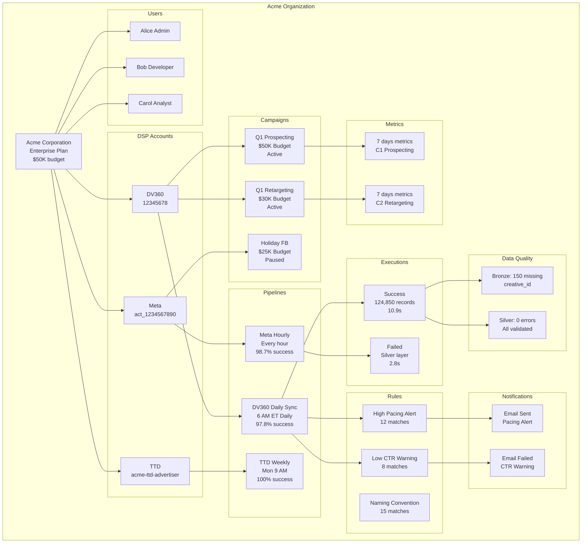
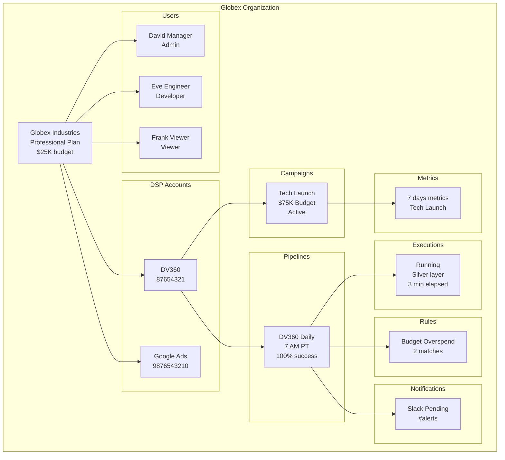
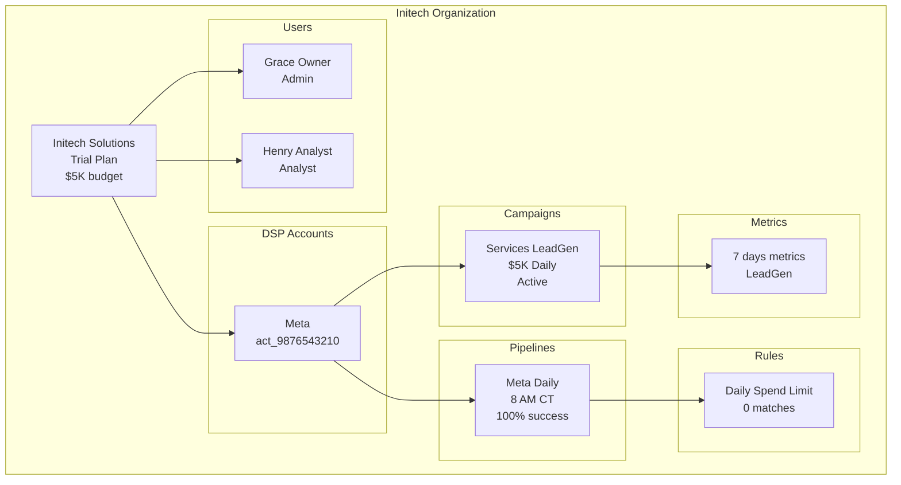
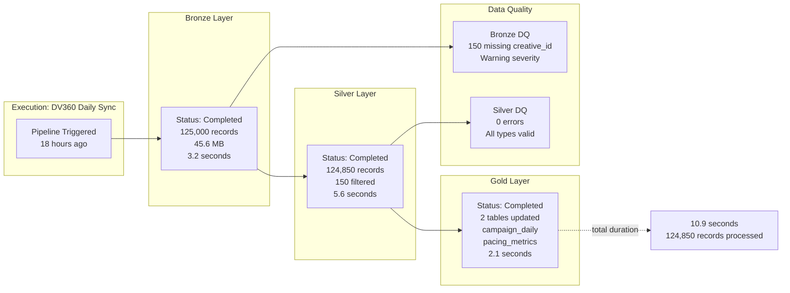
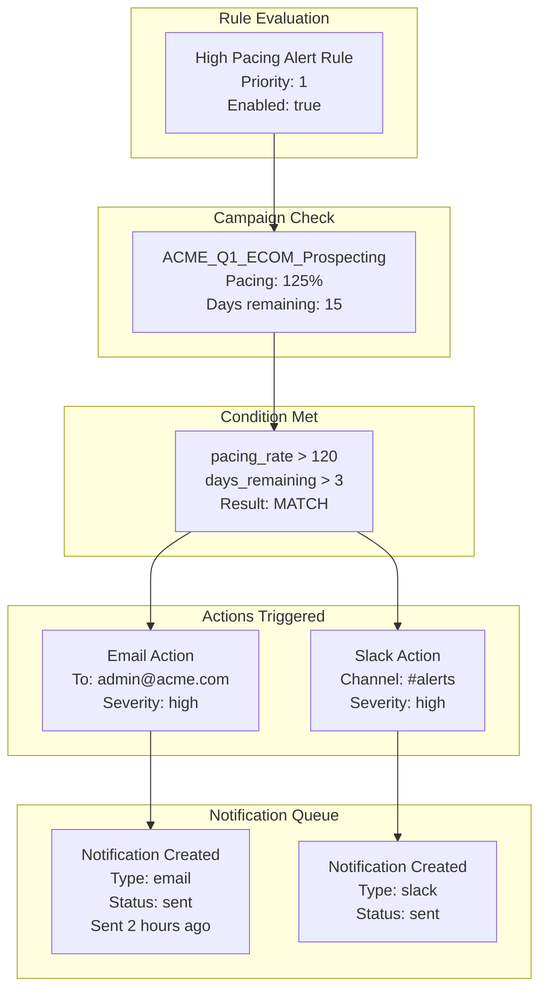

# Sample Data ER Diagram
## Campaign Lifecycle Platform - Seed Data Relationships

---

## Sample Data Entity Map

This diagram shows the **actual seed data instances** and how they relate to each other.

```mermaid
erDiagram
    %% Organizations
    ORG_ACME ||--o{ USER_ALICE : "admin"
    ORG_ACME ||--o{ USER_BOB : "developer"
    ORG_ACME ||--o{ USER_CAROL : "analyst"
    ORG_ACME ||--o{ DSP_ACME_DV360 : "owns"
    ORG_ACME ||--o{ DSP_ACME_META : "owns"
    ORG_ACME ||--o{ DSP_ACME_TTD : "owns"
    
    ORG_GLOBEX ||--o{ USER_DAVID : "admin"
    ORG_GLOBEX ||--o{ USER_EVE : "developer"
    ORG_GLOBEX ||--o{ USER_FRANK : "viewer"
    ORG_GLOBEX ||--o{ DSP_GLOBEX_DV360 : "owns"
    ORG_GLOBEX ||--o{ DSP_GLOBEX_GADS : "owns"
    
    ORG_INITECH ||--o{ USER_GRACE : "admin"
    ORG_INITECH ||--o{ USER_HENRY : "analyst"
    ORG_INITECH ||--o{ DSP_INITECH_META : "owns"
    
    %% DSP Accounts to Campaigns
    DSP_ACME_DV360 ||--o{ CAMP_ACME_PROSP : "contains"
    DSP_ACME_DV360 ||--o{ CAMP_ACME_RETARG : "contains"
    DSP_ACME_META ||--o{ CAMP_ACME_HOLIDAY : "contains"
    DSP_GLOBEX_DV360 ||--o{ CAMP_GLOBEX_LAUNCH : "contains"
    DSP_INITECH_META ||--o{ CAMP_INITECH_LEADGEN : "contains"
    
    %% Campaigns to Metrics
    CAMP_ACME_PROSP ||--o{ METRICS_PROSP_7D : "7 days"
    CAMP_ACME_RETARG ||--o{ METRICS_RETARG_7D : "7 days"
    CAMP_GLOBEX_LAUNCH ||--o{ METRICS_LAUNCH_7D : "7 days"
    CAMP_INITECH_LEADGEN ||--o{ METRICS_LEADGEN_7D : "7 days"
    
    %% Templates to Pipelines
    TMPL_DV360_DAILY ||--o{ PIPE_ACME_DV360 : "instantiates"
    TMPL_DV360_DAILY ||--o{ PIPE_GLOBEX_DV360 : "instantiates"
    TMPL_META_INSIGHTS ||--o{ PIPE_ACME_META : "instantiates"
    TMPL_META_INSIGHTS ||--o{ PIPE_INITECH_META : "instantiates"
    
    %% DSP Accounts to Pipelines
    DSP_ACME_DV360 ||--o{ PIPE_ACME_DV360 : "sources"
    DSP_ACME_META ||--o{ PIPE_ACME_META : "sources"
    DSP_ACME_TTD ||--o{ PIPE_ACME_TTD : "sources"
    DSP_GLOBEX_DV360 ||--o{ PIPE_GLOBEX_DV360 : "sources"
    DSP_INITECH_META ||--o{ PIPE_INITECH_META : "sources"
    
    %% Pipelines to Executions
    PIPE_ACME_DV360 ||--o{ EXEC_ACME_SUCCESS : "runs"
    PIPE_ACME_META ||--o{ EXEC_ACME_FAILED : "runs"
    PIPE_GLOBEX_DV360 ||--o{ EXEC_GLOBEX_RUNNING : "runs"
    
    %% Executions to DQ Metrics
    EXEC_ACME_SUCCESS ||--o{ DQ_BRONZE : "measures"
    EXEC_ACME_SUCCESS ||--o{ DQ_SILVER : "measures"
    
    %% Rules
    ORG_ACME ||--o{ RULE_HIGH_PACING : "defines"
    ORG_ACME ||--o{ RULE_LOW_CTR : "defines"
    ORG_ACME ||--o{ RULE_NAMING : "defines"
    ORG_GLOBEX ||--o{ RULE_OVERSPEND : "defines"
    ORG_INITECH ||--o{ RULE_DAILY_SPEND : "defines"
    
    PIPE_ACME_DV360 ||--o{ RULE_HIGH_PACING : "applies"
    PIPE_ACME_DV360 ||--o{ RULE_LOW_CTR : "applies"
    
    %% Notifications
    RULE_HIGH_PACING ||--o{ NOTIF_PACING_SENT : "triggered"
    RULE_LOW_CTR ||--o{ NOTIF_CTR_FAILED : "triggered"
    PIPE_GLOBEX_DV360 ||--o{ NOTIF_PIPELINE_PENDING : "status"
    
    %% Entities (Representative Sample)
    ORG_ACME {
        string name "Acme Corporation"
        string slug "acme-corp"
        string plan "enterprise"
        decimal budget "50000"
    }
    
    ORG_GLOBEX {
        string name "Globex Industries"
        string slug "globex-ind"
        string plan "professional"
        decimal budget "25000"
    }
    
    ORG_INITECH {
        string name "Initech Solutions"
        string slug "initech"
        string plan "free"
        decimal budget "5000"
    }
    
    USER_ALICE {
        string email "admin@acme.com"
        string name "Alice Admin"
        string role "admin"
    }
    
    USER_BOB {
        string email "dev@acme.com"
        string name "Bob Developer"
        string role "developer"
    }
    
    USER_CAROL {
        string email "analyst@acme.com"
        string name "Carol Analyst"
        string role "analyst"
    }
    
    USER_DAVID {
        string email "admin@globex.com"
        string name "David Manager"
        string role "admin"
    }
    
    USER_EVE {
        string email "dev@globex.com"
        string name "Eve Engineer"
        string role "developer"
    }
    
    USER_FRANK {
        string email "viewer@globex.com"
        string name "Frank Viewer"
        string role "viewer"
    }
    
    USER_GRACE {
        string email "owner@initech.com"
        string name "Grace Owner"
        string role "admin"
    }
    
    USER_HENRY {
        string email "analyst@initech.com"
        string name "Henry Analyst"
        string role "analyst"
    }
    
    DSP_ACME_DV360 {
        string dsp_type "dv360"
        string external_id "12345678"
        string name "Acme DV360 Main"
    }
    
    DSP_ACME_META {
        string dsp_type "meta"
        string external_id "act_1234567890"
        string name "Acme Meta Ads"
    }
    
    DSP_ACME_TTD {
        string dsp_type "ttd"
        string external_id "acme-ttd-advertiser"
        string name "Acme TTD"
    }
    
    DSP_GLOBEX_DV360 {
        string dsp_type "dv360"
        string external_id "87654321"
        string name "Globex DV360"
    }
    
    DSP_GLOBEX_GADS {
        string dsp_type "google_ads"
        string external_id "9876543210"
        string name "Globex Google Ads"
    }
    
    DSP_INITECH_META {
        string dsp_type "meta"
        string external_id "act_9876543210"
        string name "Initech Meta"
    }
    
    TMPL_DV360_DAILY {
        string name "DV360 Daily Performance"
        string type "pipeline"
        boolean public "true"
        int usage "156"
    }
    
    TMPL_META_INSIGHTS {
        string name "Meta Campaign Insights"
        string type "pipeline"
        boolean public "true"
        int usage "203"
    }
    
    CAMP_ACME_PROSP {
        string name "ACME_Q1_ECOM_Prospecting"
        decimal budget "50000"
        string status "active"
    }
    
    CAMP_ACME_RETARG {
        string name "ACME_Q1_ECOM_Retargeting"
        decimal budget "30000"
        string status "active"
    }
    
    CAMP_ACME_HOLIDAY {
        string name "ACME_Holiday_FB_Conversions"
        decimal budget "25000"
        string status "paused"
    }
    
    CAMP_GLOBEX_LAUNCH {
        string name "Globex_Tech_Launch_Awareness"
        decimal budget "75000"
        string status "active"
    }
    
    CAMP_INITECH_LEADGEN {
        string name "Initech_Services_LeadGen"
        decimal budget "5000"
        string status "active"
    }
    
    METRICS_PROSP_7D {
        string description "7 days × metrics"
        int records "7"
    }
    
    METRICS_RETARG_7D {
        string description "7 days × metrics"
        int records "7"
    }
    
    METRICS_LAUNCH_7D {
        string description "7 days × metrics"
        int records "7"
    }
    
    METRICS_LEADGEN_7D {
        string description "7 days × metrics"
        int records "7"
    }
    
    PIPE_ACME_DV360 {
        string name "DV360 Daily Sync"
        string schedule "0 6 * * *"
        decimal success_rate "97.8"
    }
    
    PIPE_ACME_META {
        string name "Meta Hourly Refresh"
        string schedule "0 * * * *"
        decimal success_rate "98.7"
    }
    
    PIPE_ACME_TTD {
        string name "TTD Weekly Report"
        string schedule "0 9 * * 1"
        decimal success_rate "100"
    }
    
    PIPE_GLOBEX_DV360 {
        string name "DV360 Daily Reports"
        string schedule "0 7 * * *"
        decimal success_rate "100"
    }
    
    PIPE_INITECH_META {
        string name "Meta Daily Sync"
        string schedule "0 8 * * *"
        decimal success_rate "100"
    }
    
    EXEC_ACME_SUCCESS {
        string status "completed"
        int duration_ms "10900"
        bigint records "124850"
    }
    
    EXEC_ACME_FAILED {
        string status "failed"
        int duration_ms "2800"
        bigint records "0"
    }
    
    EXEC_GLOBEX_RUNNING {
        string status "running"
        string layer "silver"
    }
    
    DQ_BRONZE {
        string layer "bronze"
        string metric "required_fields"
        int fail_count "150"
    }
    
    DQ_SILVER {
        string layer "silver"
        string metric "data_types"
        int fail_count "0"
    }
    
    RULE_HIGH_PACING {
        string name "High Pacing Alert"
        string module "pacing"
        int matches "12"
    }
    
    RULE_LOW_CTR {
        string name "Low CTR Warning"
        string module "qa"
        int matches "8"
    }
    
    RULE_NAMING {
        string name "Naming Convention Check"
        string module "taxonomy"
        int matches "15"
    }
    
    RULE_OVERSPEND {
        string name "Budget Overspend Alert"
        string module "alerts"
        int matches "2"
    }
    
    RULE_DAILY_SPEND {
        string name "Daily Spend Limit"
        string module "alerts"
        int matches "0"
    }
    
    NOTIF_PACING_SENT {
        string type "email"
        string status "sent"
        string subject "High Pacing Alert"
    }
    
    NOTIF_CTR_FAILED {
        string type "email"
        string status "failed"
        string subject "Low CTR Warning"
    }
    
    NOTIF_PIPELINE_PENDING {
        string type "slack"
        string status "pending"
        string channel "#alerts"
    }
```



---

## Data Flow: Acme Corporation



---

## Data Flow: Globex Industries



---

## Data Flow: Initech Solutions



---

## Template Marketplace Usage

```mermaid
graph LR
    subgraph "Public Templates"
        T1[DV360 Daily Performance<br/>156 uses | 4.7★]
        T2[DV360 Pacing Check<br/>89 uses | 4.5★]
        T3[Meta Campaign Insights<br/>203 uses | 4.8★]
    end
    
    subgraph "Acme Private"
        T4[Custom QA Rules<br/>12 uses]
        T5[Margin Calculator<br/>8 uses]
    end
    
    T1 -.instantiates.-> P1[Acme: DV360 Daily Sync]
    T1 -.instantiates.-> P4[Globex: DV360 Daily Reports]
    
    T3 -.instantiates.-> P2[Acme: Meta Hourly]
    T3 -.instantiates.-> P5[Initech: Meta Daily Sync]
    
    T4 -.used by.-> ACME[Acme Only]
    T5 -.used by.-> ACME
```

---

## Sample Metrics Data Pattern

```mermaid
graph TB
    subgraph "Campaign: ACME_Q1_ECOM_Prospecting"
        C[Campaign ID:<br/>70000000-1111-0001-0000-000000000001]
    end
    
    subgraph "7 Days of Metrics"
        D1[Jan 01<br/>45K imp | 850 clk<br/>$1,800 spend]
        D2[Jan 02<br/>52K imp | 920 clk<br/>$1,950 spend]
        D3[Jan 03<br/>38K imp | 710 clk<br/>$1,600 spend]
        D4[Jan 04<br/>48K imp | 880 clk<br/>$1,850 spend]
        D5[Jan 05<br/>55K imp | 950 clk<br/>$2,100 spend]
        D6[Jan 06<br/>42K imp | 790 clk<br/>$1,700 spend]
        D7[Today<br/>Pending sync]
    end
    
    C --> D1 & D2 & D3 & D4 & D5 & D6 & D7
    
    D1 -.calculated.-> CTR1[CTR: 1.89%<br/>CPC: $2.12]
    D2 -.calculated.-> CTR2[CTR: 1.77%<br/>CPC: $2.12]
    D3 -.calculated.-> CTR3[CTR: 1.87%<br/>CPC: $2.25]
```

---

## ETL Execution Breakdown



---

## Notification Flow Example



---

## Summary Statistics

### Organizations by Plan
```
Enterprise: 1 (Acme) - $50K/month
Professional: 1 (Globex) - $25K/month  
Free/Trial: 1 (Initech) - $5K/month
Total: 3 organizations
```

### Users by Role
```
Admin: 3 (Alice, David, Grace)
Developer: 2 (Bob, Eve)
Analyst: 2 (Carol, Henry)
Viewer: 1 (Frank)
Total: 9 active users
```

### DSP Accounts by Type
```
DV360: 2 (Acme, Globex)
Meta: 2 (Acme, Initech)
TTD: 1 (Acme)
Google Ads: 1 (Globex)
Total: 6 DSP accounts
```

### Campaigns by Status
```
Active: 4 campaigns
Paused: 1 campaign (Acme Holiday)
Total: 5 campaigns
```

### Campaign Metrics
```
Days of data: 7 days
Records per campaign: 7
Total metric records: 35
Active campaigns tracked: 5
```

### Pipelines by Schedule
```
Hourly: 1 (Acme Meta)
Daily: 3 (Acme DV360, Globex DV360, Initech Meta)
Weekly: 1 (Acme TTD)
Total: 5 pipelines
```

### Executions by Status
```
Completed: 1
Failed: 1
Running: 1
Total: 3 recent executions
```

### Rules by Module
```
Pacing: 1 rule
QA: 1 rule
Taxonomy: 1 rule
Alerts: 2 rules
Total: 5 rules
```

### Notifications by Status
```
Sent: 1
Pending: 1
Failed: 1
Total: 3 notifications
```

---

This sample data ER diagram shows exactly how the seed data instances relate to each other, making it easy to understand the test scenarios and data relationships.